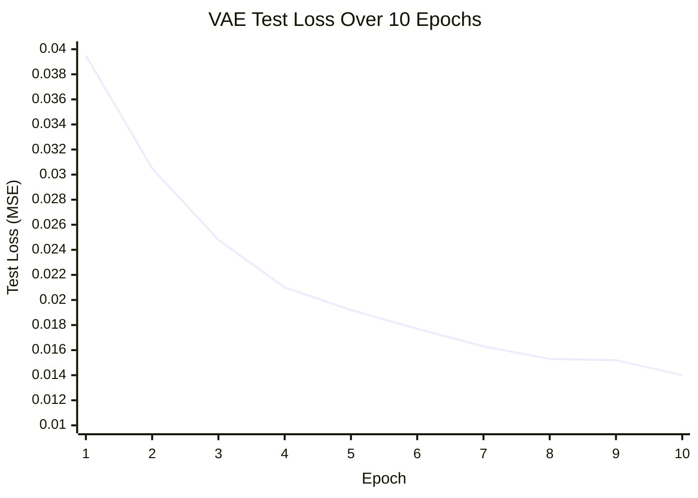

# Autoencoding Variational Bayes Implementation

The main idea is that we encode images into a smaller set of vectors called the latent space. By decoding this latent space, we generate images that are similar to our original training images.

We want to generate new images by randomly sampling from the latent space and decoding them. But we can't do this with a standard autoencoder because a normal latent space is highly irregular.

To solve this, we force the latent space to approximate a standard normal distribution. Because of this, randomly sampling from a normal distribution is guaranteed to give us high-quality images.

It is possible to forward propagate a random sample from a normal distribution, but you cannot backpropagate it. You are randomly picking a location in the distribution, and you cannot compute gradients through a purely random operation.

So we use a clear and simple trick:

```python
def reparameterize(self, _mean, _logvar):
    std = torch.exp(0.5 * _logvar)
    e = torch.randn_like(std)
    return _mean + e * std
```

In this function, we introduce randomness via the e tensor, allowing us to maintain a continuous gradient path to train the network on the mean and variance.

The second thing we did is add a custom regularizer (KL Divergence) that punishes the loss function if our latent space deviates too far from a standard normal curve.

```python
def KL(_mean, _logvar):
    return -0.5 * torch.mean(torch.sum(1 + _logvar - _mean.pow(2) - _logvar.exp(), dim=1))
```


## Loss Graph


# Referances

Kingma, D. P., & Welling, M. (2013). Auto-Encoding Variational Bayes. 2nd International Conference on Learning Representations (ICLR 2014). arXiv:1312.6114. https://arxiv.org/abs/1312.6114